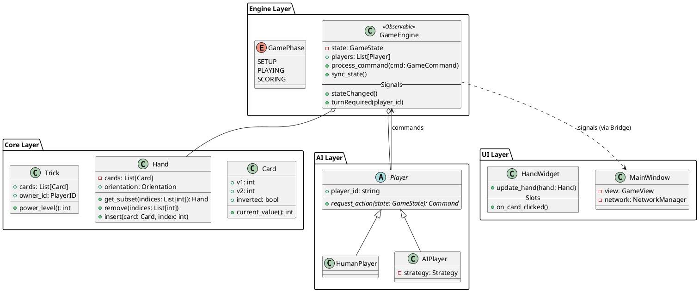

# Skout Game Architecture Design

Drafted by: Senior Python Architect

## 1. Module / Layer Breakdown

| Layer | Module | Responsibility | Owns | Dependencies | PySide6-Coupled? |
| :--- | :--- | :--- | :--- | :--- | :--- |
| **Core** | `skout.core` | Domain models and primitive logic. | `Card`, `Hand`, `Deck`, `Trick`. | None. | No |
| **Engine** | `skout.engine` | Game state machine and rule enforcement. | `GameEngine`, `ActionValidator`, `Scoring`. | `skout.core` | No |
| **Network** | `skout.network` | Peer-to-peer / Server-client communication. | `NetworkManager`, `Server`, `Client`. | `skout.core`, `skout.engine` | No (Uses asyncio) |
| **AI** | `skout.ai` | Computer player logic. | `AIPlayer`, `Strategy`, `MCTS`. | `skout.core`, `skout.engine` | No |
| **UI** | `skout.ui` | PySide6 graphical interface. | `MainWindow`, `HandWidget`, `TrickWidget`. | `skout.engine`, `skout.network` | Yes |

---

## 2. Class Diagram (PlantUML)



---

## 3. Network Layer Design

### Protocol Choice

- **Choice**: **TCP via `asyncio` streams**.
- **Rationale**: Game state consistency is critical (TCP reliability). `asyncio` provides non-blocking I/O that integrates cleanly with Qt via `qasync`.

### Message Schema (JSON)

Represented by Python `dataclasses`:

```python
@dataclass
class NetworkMessage:
    type: str  # e.g., "ACTION", "STATE_SYNC", "LOBBY_JOIN"
    payload: dict
    timestamp: float
```

### State Synchronization

- **Hybrid Snapshot**: Full state broadcast at round start; **Command Delta** during turns (re-applied by clients).
- **Lobby Flow**: Host acts as the "Source of Truth" (Authoritative Server). Clients send `GameCommand` objects; Host validates and broadcasts result.

### Event Loop Bridge

- **Approach**: **`qasync`**.
- **Rationale**: It allows the Qt event loop and `asyncio` loop to run as one, eliminating the need for complex `QThread` signal/slot marshaling for every network packet.

---

## 4. AI Design

### Algorithm: **Information Set Monte-Carlo Tree Search (ISMCTS)**

- **Rationale**: Skout is a hidden-information game (you don't see opponents' card backs/secondary values). ISMCTS handles "determinization" (shuffling unknown cards) to simulate possible opponent hands.
- **Hook**: Command Pattern. The `AIPlayer` listens for `turnRequired` signals, runs the strategy in a background thread, and pushes a `GameCommand` back to the `GameEngine`.
- **Scaling**: Adjust number of simulations (MCTS iterations) or use "rule-based pruning" for lower difficulties.

---

## 5. Key Design Decisions

| Decision | Choice | Rationale |
| :--- | :--- | :--- |
| **UI Pattern** | **MVVM** | Decouples rich widget logic (Hand movement) from game logic. |
| **Serialization** | **JSON (msgpack optional)** | Easiest for cross-environment debugging and Python integration. |
| **Hand Structure** | **Custom List Wrapper** | Enforces "No Reorder" by not providing `.sort()` or `.shuffle()` methods on `Hand`. |
| **Threading** | **`qasync` + `concurrent.futures`** | Unified I/O loop; CPU-heavy AI runs in Process/Thread Pool. |
| **Type Safety** | **Dataclasses + TypeGuard** | Native Python speed with high readability and IDE support. |

---

## 6. File/Directory Layout

```text
skout/
├── pyproject.toml         # Build system dependencies (Pept 517/621)
├── README.md
├── main.py                # Entry point
├── assets/                # Card images, sounds
├── skout/
│   ├── __init__.py
│   ├── core/
│   │   ├── card.py        # Card and Hand dataclasses
│   │   └── trick.py
│   ├── engine/
│   │   ├── engine.py      # State machine
│   │   └── rules.py       # Skout-specific legal move logic
│   ├── network/
│   │   ├── client.py
│   │   ├── server.py
│   │   └── message.py
│   ├── ai/
│   │   ├── player.py
│   │   └── mcts.py
│   └── ui/
│       ├── main_window.py
│       ├── widgets/
│       │   ├── hand_widget.py
│       │   └── card_widget.py
│       └── resources.qrc   # Qt resources
└── tests/
    ├── test_core.py       # Pytest suite (Qt-independent)
    └── test_rules.py
```
